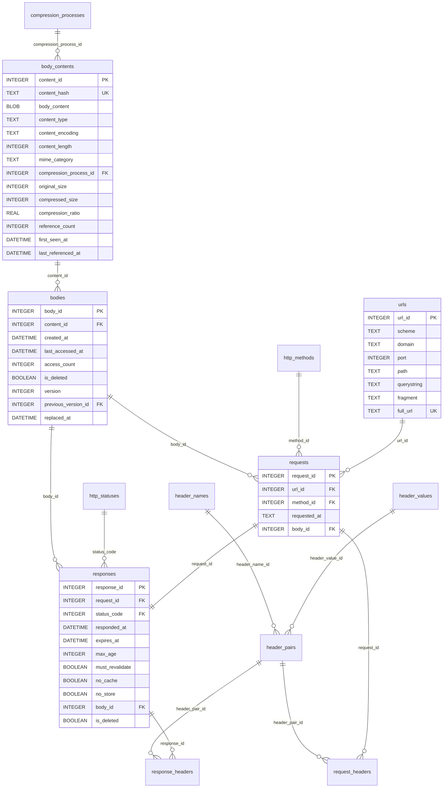
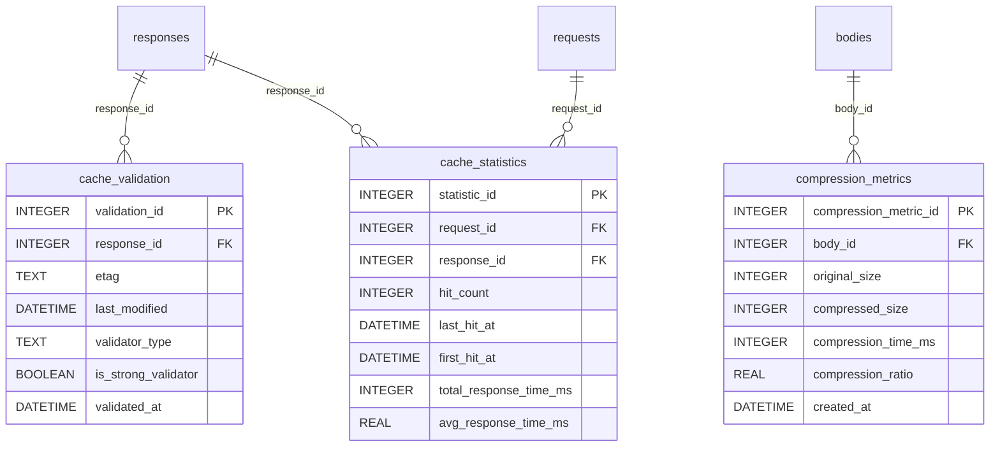
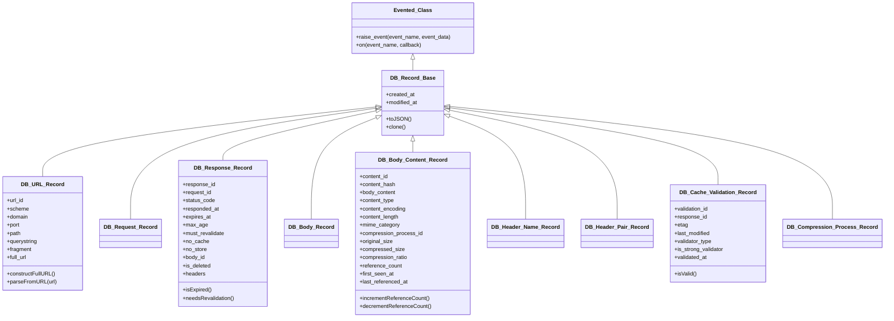
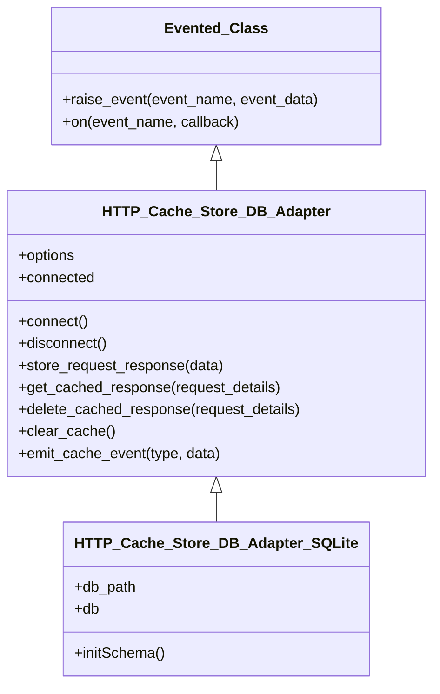
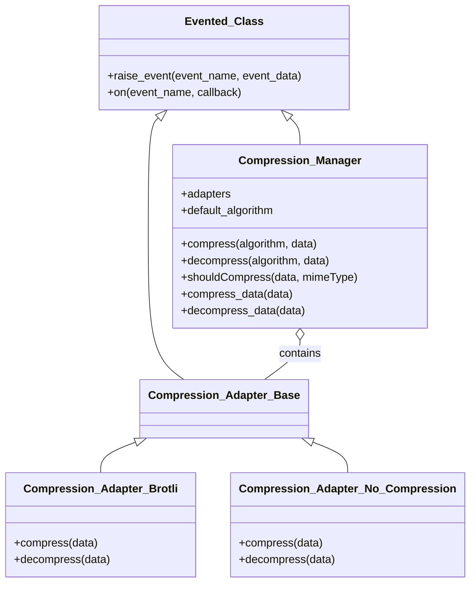
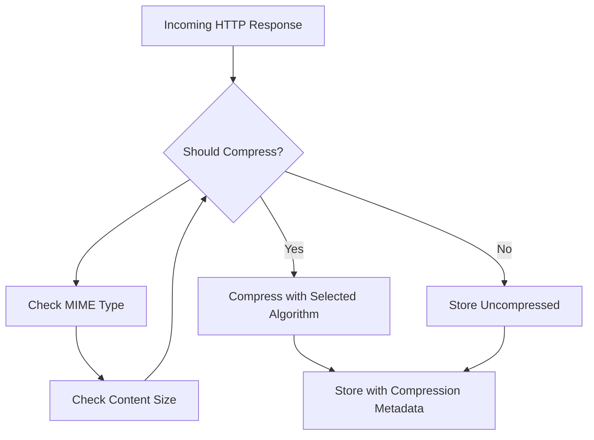
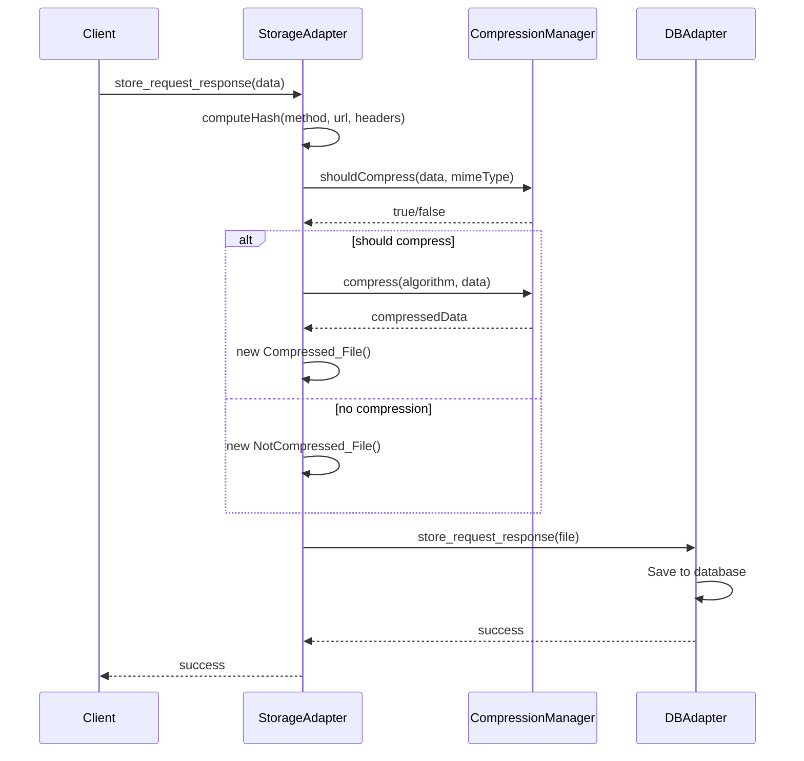
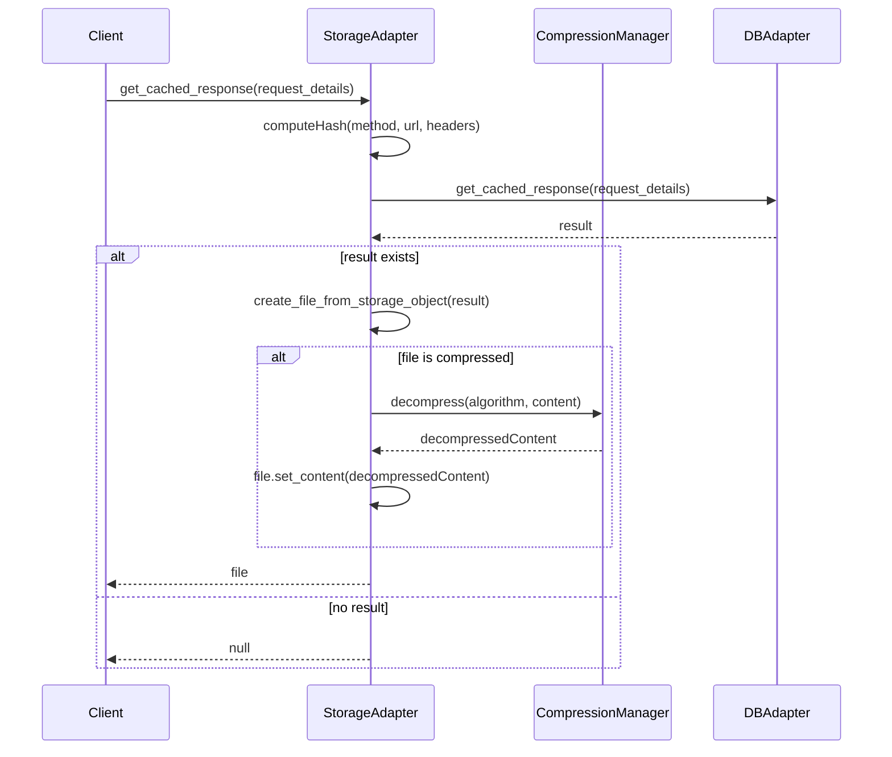

# Database Module for http-cache-store

## Introduction

The `/db` module is the data persistence layer of the http-cache-store system, responsible for efficiently storing, retrieving, and managing HTTP cache data. It implements a sophisticated normalized database schema with content deduplication, compression, and versioning capabilities.

### Core Functionality

This module provides:

1. **Abstracted Database Access**: Through adapter interfaces that allow swapping between SQLite and potentially other backends without changing client code.

2. **Content-Aware Compression**: Data is intelligently compressed based on MIME type, content size, and potential compression benefit.

3. **Cache Validation Framework**: Support for HTTP caching standards including ETags, Last-Modified headers, and Cache-Control directives.

4. **Event-Driven Architecture**: All operations emit events that can be observed for metrics, logging, or custom behavior.

5. **Storage Optimization**: Automatic content deduplication ensures the same response body is only stored once regardless of how many requests reference it.

### Design Philosophy

The module follows these key principles:

- **Separation of Concerns**: Each component has a clearly defined role in the storage pipeline.
- **Immutable Data Model**: Content is identified by secure hashes and never modified after storage.
- **Extensibility**: Record classes and adapters can be extended with custom behavior.
- **Performance Focus**: Schema design, indexing, and binary handling are optimized for caching workloads.

---

## Table of Contents

- [Module Structure](#module-structure)
- [Database Schema](#database-schema)
- [Entity Relationships](#entity-relationships)
- [Record Classes](#record-classes)
- [Database Adapters](#database-adapters)
- [Compression System](#compression-system)
- [Key Operations](#key-operations)
- [Integration Patterns](#integration-patterns)

## Module Structure

```
/db
├── adapter/             # Database adapters for different backends
│   ├── HTTP_Cache_Store_DB_Adapter_Base.js    # Abstract interface
│   └── HTTP_Cache_Store_DB_Adapter_SQLite.js  # SQLite implementation 
├── compression/         # Compression algorithms and management
│   ├── Compression_Adapter_Base.js            # Base adapter interface
│   ├── Compression_Adapter_Brotli.js          # Brotli compression
│   ├── Compression_Adapter_No_Compression.js  # Pass-through adapter
│   └── Compression_Manager.js                 # Algorithm selection & coordination
├── record/              # Data record classes representing DB entities
│   ├── DB_Record_Base.js                # Common base class
│   ├── DB_URL_Record.js                 # URL parsing & normalization
│   ├── DB_Request_Record.js             # HTTP request metadata
│   ├── DB_Response_Record.js            # HTTP response with cache controls
│   ├── DB_Body_Record.js                # Response body version tracking
│   ├── DB_Body_Content_Record.js        # Actual content with compression details
│   ├── DB_Header_Name_Record.js         # Header name definitions
│   ├── DB_Header_Pair_Record.js         # Name-value header pairs
│   ├── DB_Cache_Validation_Record.js    # ETag and Last-Modified tracking
│   └── DB_Compression_Process_Record.js # Compression algorithm settings
└── sql/                 # SQL schema definitions
    └── schema_common.sql               # Common SQL schema for all adapters
```

## Database Schema

The database schema follows a normalized structure to efficiently store HTTP cache data while supporting advanced features like versioning, cache validation, and compression statistics.

### Core Tables



### Auxiliary Tables



### Schema Highlights

- **Content Deduplication**: The `body_contents` table stores unique content by hash, with `reference_count` tracking how many bodies reference it
- **Version Control**: Bodies track version history through `previous_version_id` references
- **Performance Metrics**: Detailed statistics on compression effectiveness and cache hit rates
- **Cache Validation**: Dedicated tracking of ETag and Last-Modified validators for HTTP cache control
- **Header Storage**: Normalized storage of HTTP headers to avoid redundancy

## Record Classes

The record classes provide an object-oriented interface to the database schema, adding validation, events, and helper methods.

### Class Hierarchy



### Key Features

- **Event System**: All record classes emit events (e.g., 'accessed', 'reference_count_changed', 'version_created')
- **Immutable Hashes**: Content is identified by SHA-256 hashes of the uncompressed content
- **Serialization**: All records have `toJSON()` for data exchange
- **Normalization**: URL components are normalized, HTTP headers are canonicalized to lowercase
- **Validation**: Records include validation of their properties

## Database Adapters

The database adapter pattern allows for multiple backend implementations while providing a consistent interface.

### Adapter Architecture



### SQLite Implementation

```javascript
// Example: Storing a response with SQLite adapter
const adapter = new HTTP_Cache_Store_DB_Adapter_SQLite({ db_path: 'cache.db' });
await adapter.connect();

const fileObj = new Compressed_File({
    hash: Buffer.from([0x01, 0x02, 0x03]),
    mime_type: 'text/html',
    compression_algorithm: 'brotli'
});
fileObj.set_content(compressedHtmlContent);
fileObj.metadata = {
    method: 'GET',
    url: 'https://example.com',
    status_code: 200
};

await adapter.store_request_response(fileObj);
```

### Key Features

- **Binary Support**: Handles binary data storage and retrieval
- **Connection Management**: Consistent connect/disconnect interface
- **Event Emission**: Emits events for all operations (e.g., 'connected', 'cache_hit', 'store_success')
- **Schema Initialization**: Automatic schema creation
- **WAL Journal Mode**: Uses SQLite's WAL mode for better concurrency

## Compression System

The compression system provides a unified interface for multiple compression algorithms with intelligent content-aware selection.

### Component Architecture



### Compression Process



### Algorithm Selection Logic

- **MIME Type Analysis**: Text-based types (HTML, CSS, JS, JSON) are compressed
- **Size Thresholds**: Small responses (< 100 bytes) bypass compression
- **Already Compressed**: Image, video, audio, and pre-compressed formats are not re-compressed
- **Brotli By Default**: Modern algorithm with good compression ratio/speed tradeoff

## Key Operations

### Cache Storage Process



### Cache Retrieval Process



## Integration Patterns

### Event-Based Integration

All components emit events that can be used for metrics, logging, and integration:

```javascript
// Example: Monitoring compression performance
const dbAdapter = new HTTP_Cache_Store_DB_Adapter_SQLite({ db_path: 'cache.db' });

// Listen for storage events
dbAdapter.on('store_success', (data) => {
    console.log(`Stored: ${data.metadata?.url}`);
    
    if (data.is_compressed) {
        const ratio = (data.original_size / data.compressed_size).toFixed(2);
        console.log(`Compression ratio: ${ratio}x (saved ${data.original_size - data.compressed_size} bytes)`);
    }
});

// Listen for cache hits/misses
dbAdapter.on('cache_hit', (data) => {
    console.log(`Cache hit: ${data.metadata?.url}`);
});

dbAdapter.on('cache_miss', (data) => {
    console.log(`Cache miss: ${data.url}`);
});
```

### Analytics Using Views

The schema includes views for analytics:

```sql
-- Compression Effectiveness by MIME Category
SELECT 
    mime_category,
    COUNT(*) as total_items,
    AVG(compression_ratio) as avg_compression_ratio
FROM body_contents
WHERE compression_process_id IS NOT NULL
GROUP BY mime_category
ORDER BY avg_compression_ratio DESC;

-- Cache Hit Rate by Day
SELECT 
    DATE(first_hit_at) as date,
    COUNT(*) as total_requests,
    SUM(hit_count) as total_hits,
    AVG(avg_response_time_ms) as avg_response_time
FROM cache_statistics
GROUP BY date;
```

### Extension Points

The database module provides several extension points:

1. **New Compression Algorithms**: Implement `Compression_Adapter_Base` for new algorithms
2. **Alternative DB Backends**: Implement `HTTP_Cache_Store_DB_Adapter` for NoSQL or other SQL databases
3. **Custom Record Validation**: Extend record classes with additional validation
4. **New Metrics Collection**: Add listeners for events to collect custom analytics
5. **Migration Support**: Include schema version tracking for future upgrades

## Performance Considerations

- **Content Deduplication**: Reduces storage requirements by only storing unique content bodies
- **Binary Optimizations**: All adapters handle binary data efficiently
- **Index Strategy**: Optimized SQL indexes for common query patterns
- **Lazy Loading**: Record relationships are loaded on-demand
- **Connection Pooling**: SQLite adapter supports connection pooling for multi-threading

For more details on implementation, see the [API Documentation](../API_DOCUMENTATION.md) and the [FUTURE](../../FUTURE.md) document for upcoming enhancements.
